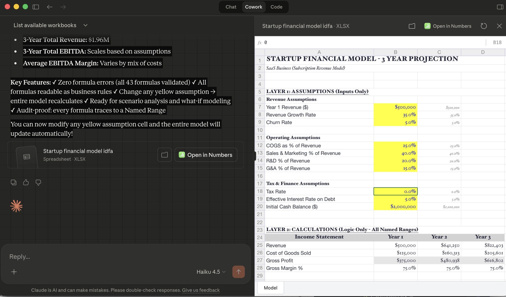

# The Three Layers

In Lesson 2, you saw the difference between a formula that reads `=B14-(C14*$F$8)` and one that reads `=Revenue_Y3 - COGS_Y3`. The first is a coordinate. The second is a business rule. Now you will learn the architecture that makes the second kind of formula possible: and makes the first kind unnecessary.

A CFO gives you a one-paragraph description of what she wants modelled: a three-year Gross Profit Waterfall with revenue growing at 10% and COGS improving by one percentage point annually. That paragraph contains four assumptions, three years of calculations, and an output table. Your job is to turn that prose into a structured, layered model where every formula explains itself and every input is named. IDFA gives you the architecture to do it systematically: and by the end of this lesson, you will have built the Assumptions layer of that model.

## Three Layers, Three Rules

Every IDFA-compliant model has exactly three layers. They must remain separate. No exceptions.

**Layer 1: Assumptions (Inputs Only).** Every value that a user can change lives here and nowhere else. Each input gets a Named Range before any formula references it. No calculations occur in this layer. If you see a formula in Layer 1, something is wrong.

**Layer 2 (Calculations (Logic Only).** Every formula reads Named Ranges only) zero cell-address references. Every formula must be readable as a plain-English sentence. No hardcoded values; all constants come from Layer 1. If you see `=B14*0.60` in Layer 2, the `0.60` should be a Named Range in Layer 1.

**Layer 3 (Output (Presentation Only).** Reads from Layer 2 only. Never from Layer 1 directly. Performs no calculations) display, formatting, and charts only. If you see arithmetic in Layer 3, it belongs in Layer 2.

The three layers can live on separate Excel tabs or on separate sections of one tab. What matters is functional isolation, not physical location. The important thing is that each layer does exactly one job.

### The Isolation Rule

Here is the architectural payoff: **changing a Layer 1 input can never break a Layer 2 formula**. Why? Because Layer 2 reads names, not positions. When you insert a row in the Assumptions tab, move a cell, or reorganise the layout entirely, the Named Range `Inp_Rev_Y1` still points to the correct value. The formula `=Inp_Rev_Y1 * (1 + Inp_Rev_Growth)` does not care where `Inp_Rev_Y1` lives in the grid. It only cares what it is called.

This is what separates IDFA from conventional modelling. In a coordinate-based model, structural changes break formulas silently. In an IDFA-compliant model, structural changes cannot break formulas at all, because the formulas were never connected to the structure in the first place.

| Property                       | Coordinate-First               | IDFA (Logic-First)                     |
| ------------------------------ | ------------------------------ | -------------------------------------- |
| Formula reads                  | Cell addresses (B14, $F$8)     | Named Ranges (Revenue_Y3, COGS_Pct_Y2) |
| Row insertion breaks formulas? | Often (silently               | Never) names survive moves            |
| New analyst reads formula?     | Must trace every cell          | Reads as business rule                 |
| AI agent reads formula?        | Sees positions, guesses intent | Sees intent directly                   |

---

> **CONCEPT BOX: What Is a Named Range?**
>
> A **Named Range** is an Excel feature that assigns a human-readable name to a cell or range of cells. Instead of referring to cell B4 as `B4`, you give it a name like `Inp_Rev_Y1`: and every formula in the workbook can reference that name.
>
> **How to create one (5 seconds):**
>
> 1. Select the cell you want to name
> 2. Click the **Name Box**: the small field at the top-left of the spreadsheet that shows the current cell address (e.g., "B4")
> 3. Type the name you want (e.g., `Inp_Rev_Y1`)
> 4. Press **Enter**
>
> That cell is now named. You can type `=Inp_Rev_Y1` in any cell on any tab, and Excel will return the value from that cell.
>
> **Alternative method:** Go to the Formulas tab and click Define Name. This opens a dialog where you can set the name, scope, and add a comment.
>
> **Why Named Ranges survive model changes:** A Named Range is stored as a definition (`Inp_Rev_Y1 = Sheet1!$B$4`). When you insert rows or move cells, Excel updates the definition automatically. The name itself never changes: so every formula referencing that name continues to work.

---

## Naming Conventions

Naming conventions are not cosmetic. They are the system that lets any reader (human or AI) instantly distinguish an input from a calculation, a yearly figure from a total, and a ratio from an absolute value.

| Category                | Prefix / Pattern | Example                                    | What it tells the reader                    |
| ----------------------- | ---------------- | ------------------------------------------ | ------------------------------------------- |
| Input assumptions       | `Inp_`           | `Inp_Rev_Y1`, `Inp_COGS_Pct_Y1`            | This is a user-modifiable input             |
| Annual calculations     | `Variable_Yn`    | `Revenue_Y1`, `COGS_Y2`, `Gross_Profit_Y3` | This is a derived value for a specific year |
| Multi-period aggregates | `Variable_Total` | `Revenue_Total`, `EBITDA_Total`            | This summarises across all periods          |
| Ratios and margins      | `Variable_Pct`   | `Gross_Margin_Pct_Y2`, `EBITDA_Margin_Pct` | This is a percentage or ratio               |

**Rules that prevent confusion:**

- Use underscores only: no spaces, no hyphens
- Include the dimension (year, quarter, period) in every periodic variable
- Prefix all assumptions with `Inp_` so any reader can distinguish inputs from calculations at a glance
- Keep names under 64 characters (Excel's limit for Named Ranges)

The `Inp_` prefix is the most important convention. When you see `Inp_Rev_Growth` in a formula, you know immediately that this value comes from the Assumptions layer and can be changed by the user. When you see `Revenue_Y2`, you know this is calculated: do not overwrite it with a hardcoded number.

## From Intent Statement to Assumptions Layer

Every IDFA model build starts the same way: someone describes what they want in plain English, and you extract every assumption before writing a single formula. This is **intent statement decomposition**: the skill that turns prose into structure.

Here is the intent statement for the model you will build:

> _"Project a 3-year Gross Profit Waterfall. Year 1 Revenue is $10M, growing 10% year over year. COGS starts at 60% of Revenue but improves by 1 percentage point each year due to economies of scale."_

Read that paragraph carefully. How many assumptions does it contain? Four:

| Assumption                  | Named Range           | Value      | Why this name                                  |
| --------------------------- | --------------------- | ---------- | ---------------------------------------------- |
| Year 1 Revenue              | `Inp_Rev_Y1`          | 10,000,000 | `Inp_` = input, `Rev` = revenue, `Y1` = year 1 |
| Revenue growth rate         | `Inp_Rev_Growth`      | 0.10       | No year suffix because it applies to all years |
| Year 1 COGS percentage      | `Inp_COGS_Pct_Y1`     | 0.60       | `Pct` = percentage, `Y1` = starting year       |
| Annual COGS efficiency gain | `Inp_COGS_Efficiency` | 0.01       | No year suffix because it applies uniformly    |

Notice what is not here: there is no `Revenue_Y2`, no `Gross_Profit_Y3`, no formula of any kind. Those belong in Layer 2. The Assumptions layer contains only the raw inputs: the numbers that a user can change to test a different scenario.

---

> **CONCEPT BOX: What Is a Gross Profit Waterfall?**
>
> A **Gross Profit Waterfall** shows how Revenue turns into Gross Profit after subtracting Cost of Goods Sold (COGS). It is called a "waterfall" because each step flows down from the previous one:
>
> **Revenue** minus **COGS** equals **Gross Profit**
>
> In a multi-year projection, you see the waterfall across years: how revenue grows, how COGS percentage changes, and how those two forces combine to produce the gross profit trend.
>
> Gross Profit is the first profitability line item on any income statement. Everything else (operating expenses, interest, tax) comes after it. If Gross Profit is wrong, everything below it is wrong too.

---

## Exercise: Build the Assumptions Layer

:::tip Plugin Setup Reminder
This exercise requires the **IDFA Financial Architect** plugin installed in Cowork. If you have not set it up yet, follow the instructions in the [Chapter 29 prerequisites](./README.md#prerequisites) before continuing.
:::

You will build the Assumptions layer for the GP Waterfall using Cowork. The goal is not just to produce a spreadsheet: it is to evaluate what the agent builds against the IDFA principles you just learned.

:::info New to Named Ranges?
Named Ranges are not visible in the spreadsheet grid: they are metadata that lives behind the cells. You cannot see them by looking at a spreadsheet; you have to ask. If this concept is unfamiliar, read the **Concept Box** earlier in this lesson before continuing. You need to understand what a Named Range is: and why it matters: to evaluate whether the agent created them correctly.
:::

### Step 1: Prompt Cowork to Build the Assumptions Layer

Open Cowork and type:

```
Build me a simple Gross Profit Waterfall Assumptions layer in Excel.
Year 1 Revenue is $10M, growing 10% year over year. COGS starts at
60% of Revenue and improves by 1 percentage point each year. Use
Named Ranges with the Inp_ prefix for every input. Assumptions only
— no calculations yet.
```

Cowork will create a spreadsheet. When it appears in the chat, click the file to open it in the **Cowork side panel**: this is where you inspect and interact with the model:



### Step 2: Verify Against IDFA Principles

You can see the spreadsheet values in the side panel, but Named Ranges are metadata: they are not visible in the grid. To verify what was actually built, ask Cowork:

```
List every Named Range in this spreadsheet. For each one, show me
the name, the cell it points to, and the current value. Then tell
me: do all names follow the IDFA Inp_ convention?
```

Compare the response against what you expect from the intent statement: four assumptions, each with an `Inp_` prefix:

| Assumption                  | Expected Named Range  | Value      |
| --------------------------- | --------------------- | ---------- |
| Year 1 Revenue              | `Inp_Rev_Y1`          | 10,000,000 |
| Revenue growth rate         | `Inp_Rev_Growth`      | 0.10       |
| Year 1 COGS percentage      | `Inp_COGS_Pct_Y1`     | 0.60       |
| Annual COGS efficiency gain | `Inp_COGS_Efficiency` | 0.01       |

**What to look for in the response:**

- **Wrong count?** If there are more or fewer than four Named Ranges, the agent either missed an assumption or added calculations that belong in Layer 2.
- **Missing `Inp_` prefix?** If any name reads `Revenue_Y1` instead of `Inp_Rev_Y1`, that name does not distinguish an input from a calculation. Ask Cowork: "Rename Revenue*Y1 to Inp_Rev_Y1: all assumptions need the Inp* prefix."
- **Formulas in the Assumptions layer?** If any Named Range points to a formula instead of a constant, that cell belongs in Layer 2. Ask Cowork to move it.
- **Inconsistent naming?** Spaces, hyphens, or missing dimension suffixes (`_Y1`) all violate the conventions. Ask Cowork to fix them.

### Step 3: Extend the Model

Once the four assumptions are verified, prompt Cowork:

```
Add a fifth assumption: Inp_Tax_Rate = 0.25 (corporate tax rate of
25%). Keep it in the Assumptions layer with the same Inp_ naming
convention.
```

Verify that the new Named Range appears correctly and does not disturb the existing four. This tests the isolation property: adding a new input should never break existing inputs.

:::note Keep This File
Save this spreadsheet: you will extend it with a Calculations layer in Lesson 4.
:::

**What you have built:** A clean Assumptions layer with named inputs. Every formula in the Calculations layer (Lesson 4) will reference these names. When someone changes `Inp_Rev_Y1` from $10M to $12M, every downstream calculation will update automatically: and no formula will break, because no formula references a cell position.

## The Business Bottom Line

Model handover is one of the most expensive activities in corporate finance; not because it is technically complex, but because every handover requires reconstructing the model logic from cell addresses. With IDFA's three layers and naming conventions, a new analyst opens the model, reads `=Revenue_Y2 * COGS_Pct_Y2`, and understands the business rule without a walkthrough. Onboarding time drops from days to minutes. The model explains itself.

## Capability Preview: Intent Synthesis

What you did in this lesson: reading an intent statement, prompting the agent to extract assumptions, and then verifying the result: is the core loop of working with a Finance Domain Agent. In Lesson 11, you will see the agent take an intent statement it has never seen, decompose it into Named Ranges, propose the complete three-layer structure, and wait for your approval before writing anything to the model. That capability is called **Intent Synthesis**, and it is the first of five Finance Domain Agent capabilities you will validate. The foundation you built today: understanding what belongs in Layer 1 and how to name it: is what lets you evaluate whether the agent got it right.

## Try With AI

Use these prompts in Cowork or your preferred AI assistant.

### Prompt 1: Extract Assumptions from a New Intent Statement

```
Here is an intent statement for a financial model:

"Build a 2-year operating expense forecast. Year 1 headcount
is 50 employees at an average salary of $85,000. Headcount
grows 20% in Year 2. Benefits cost 25% of total salary.
Office rent is $500,000 per year, fixed."

Extract every assumption from this statement. For each one,
give me the Named Range name (using IDFA Inp_ convention),
the value, and which part of the sentence it comes from.

Then tell me: did I miss any assumptions that would be needed
to complete the model?
```

**What you're learning:** Intent statement decomposition is a pattern, not a talent. Every assumption in the prose becomes an `Inp_` Named Range. The ability to identify missing assumptions trains you to write more complete intent statements: which produce better models on the first try.

### Prompt 2: Verify Layer Isolation

```
I have a financial model with these formulas:

Cell D10: =B4*1.10
Cell D11: =D10*0.60
Cell D12: =D10-D11

Check this model for IDFA compliance. Specifically:
1. Are there any hardcoded values that should be Named Ranges?
2. Are there any cell-address references that should be Named
   Range references?
3. Which layer does each cell belong to, and are the layers
   properly separated?

Rewrite the formulas so they are IDFA-compliant.
```

**What you're learning:** Layer isolation violations are easy to create and hard to spot: especially hardcoded numbers like `1.10` and `0.60` that look like "just the formula." Training your eye to catch embedded constants is the first step toward building models where every assumption is visible and changeable.

### Prompt 3: Review Naming Conventions

```
I created these Named Ranges for my model:

- rev_year1 = 10000000
- growth = 0.10
- cogs percent = 0.60
- efficiency_gain = 0.01
- Revenue Y2 = formula
- GP_Y1 = formula

Review each name against IDFA naming conventions. For each
one that does not comply, explain the violation and suggest
the correct name.
```

**What you're learning:** Naming conventions enforce consistency across models and teams. When every model in an organisation uses `Inp_Rev_Y1` instead of `rev_year1` or `Revenue Year 1`, any analyst and any agent can read any model without relearning the naming scheme. The discipline of consistent naming is what makes IDFA scale from one model to an entire finance department.

## Flashcards Study Aid

<Flashcards />

---

Continue to [Lesson 4: Named Range Priority: Guardrail 1 →](./04-named-range-priority.md)
