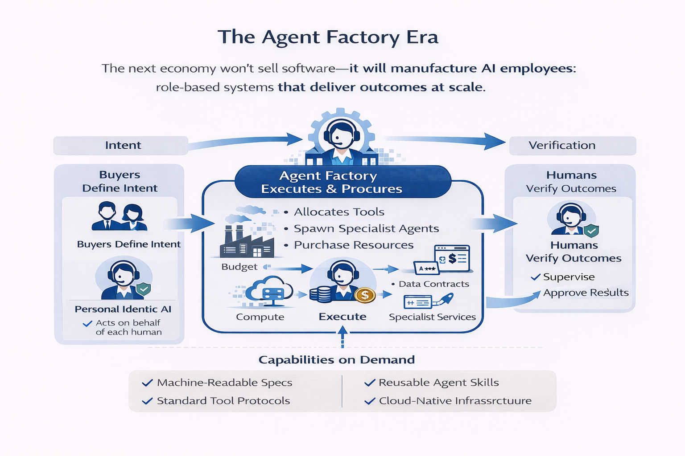
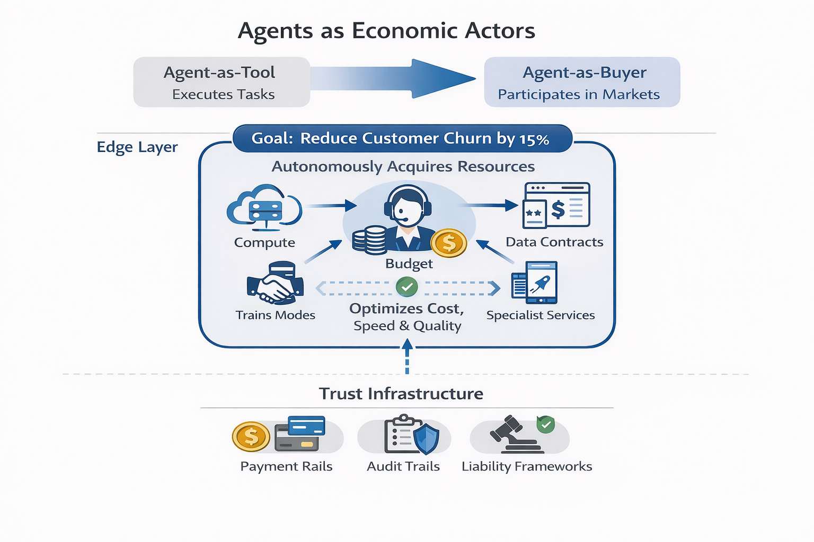
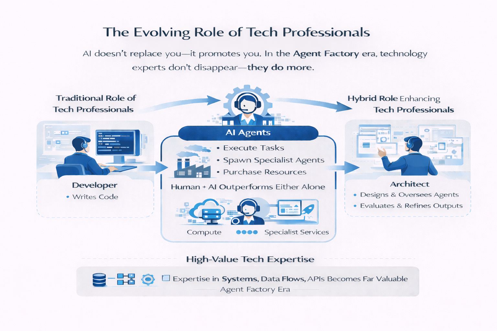
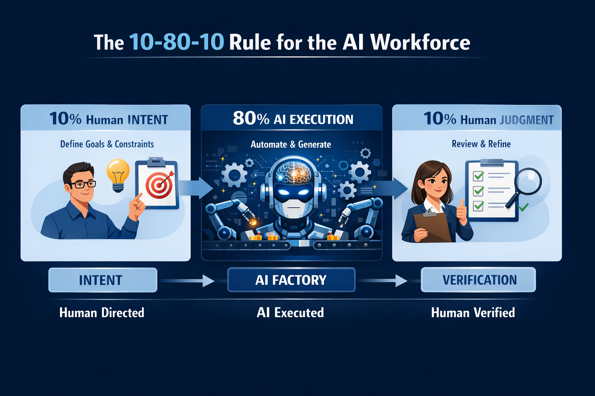
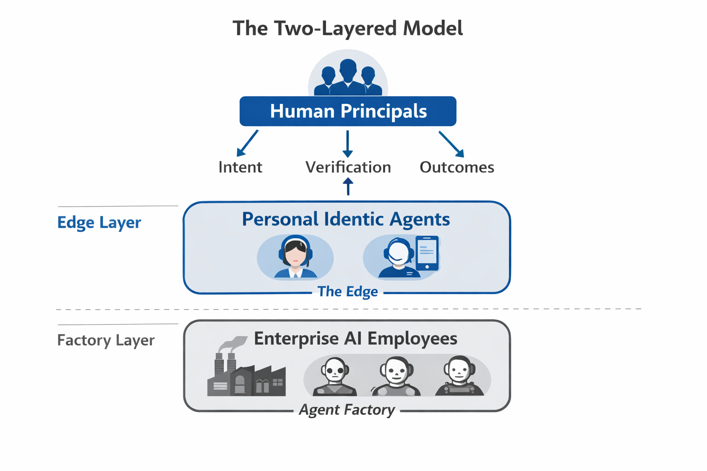
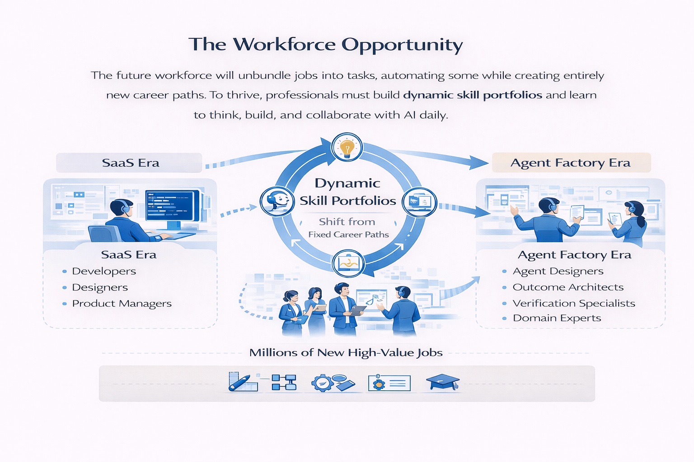
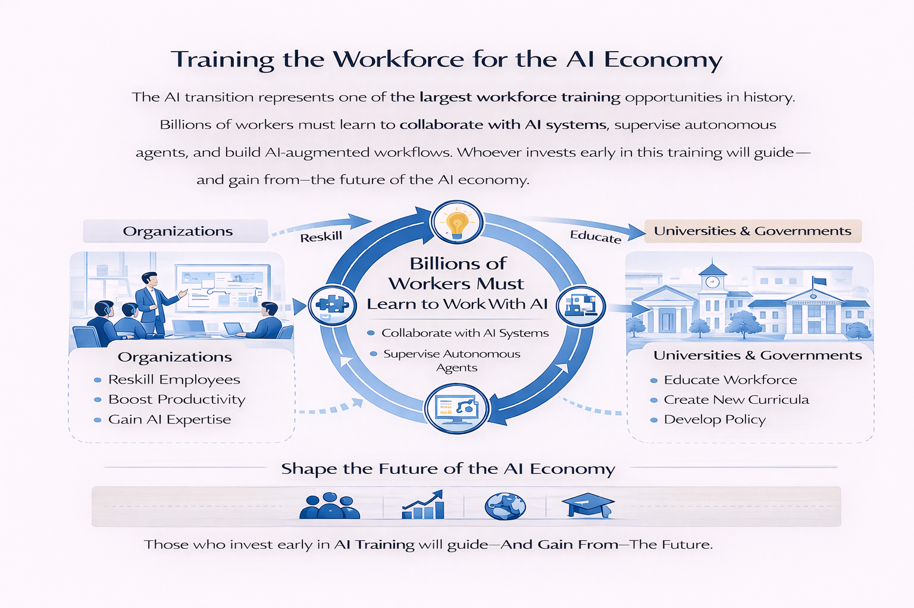
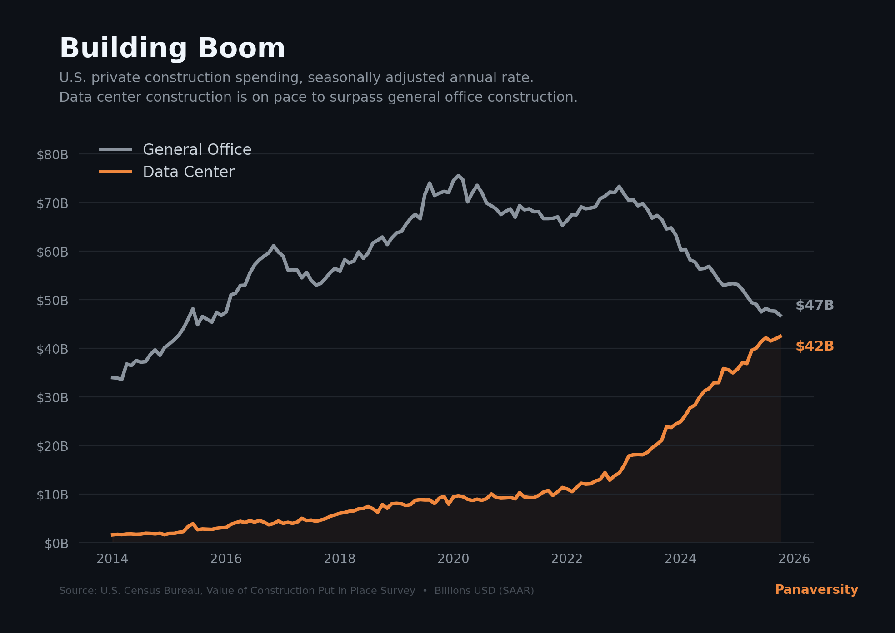

In the AI era, the most valuable companies won't sell software—they'll manufacture <em>AI employees</em>: role-based systems that compose tools, spawn specialist agents, and deliver outcomes at scale. And these AI employees are on the verge of becoming something more: <strong>fully-fledged economic actors</strong> that autonomously buy services, procure compute, and acquire data in the course of accomplishing high-level goals. We are one to two years away from seeing this at scale.

The SaaS era sold subscriptions; the Agent Factory era sells results. Buyers define intent. Agents execute. Humans supervise and verify. In practice, the AI workforce works best when humans own the first 10 percent of direction, AI handles the middle 80 percent of execution, and humans return for the final 10 percent of judgment and verification. Soon, agents won't just <em>do</em> the work—they'll <em>source what they need</em> to do it, dynamically purchasing resources within budgets and permission envelopes set by their human supervisors. This model industrializes execution through machine-readable specs, reusable skills, Standard Tool Protocols (MCP: a shared tool-connection standard), and cloud-native infrastructure—shifting the focus from manual workflows to <strong>capability on demand</strong>.

What remains: Intent. Verification. Outcome.

Intent doesn't type itself into a spec. It comes from a person — their judgment, their domain knowledge, their values. But as AI employees multiply, no professional can orchestrate them all by hand. They'll act through a personal agent that reflects their judgment and delegates on their behalf — what Don Tapscott calls identic AI.¹ The Agent Factory manufactures the workforce; identic AI is how each human commands it.

## 📚 Teaching Aid

[🖥️ Fullscreen](https://pub-80f166e40b854371ac7b05053b435162.r2.dev/books/ai-native-dev/static/slides/part-0/chapter-00/agent-factory-thesis.pdf)

---

### The Paradigm Shift

| Feature                  | The SaaS Era (Tools)            | The Agent Factory Era (Labor)                    |
| ------------------------ | ------------------------------- | ------------------------------------------------ |
| **Product**              | Software Tools                  | AI Employees                                     |
| **Value Metric**         | Per-Seat Subscriptions          | Per-Outcome Results                              |
| **Execution Model**      | Manual & Visible                | Automated & Industrialized                       |
| **Resource Acquisition** | Humans procure tools & services | Agents buy compute, data & services autonomously |
| **Human Role**           | Operator                        | Supervisor & Verifier                            |
| **Integration**          | Rigid, point-to-point APIs      | Standard Tool Protocols (MCP)                    |
| **Focus**                | How the work is done            | _That_ the work is done—verifiably correct       |

### The Industrialized Stack

- **Intent:** The high-level blueprint—goals, constraints, budgets, and permissions.
- **The Factory:** The production engine that transforms intent into outcomes. Described in detail below.
- **Outcome:** High-fidelity actions and artifacts—delivered on demand, verified for accuracy, and continuously improved through feedback loops.

### The Factory: From Intent to Outcome

The Factory is the core of the thesis—the production engine that sits between what someone wants and what they get. It is not a single piece of software. It is an architecture: a set of principles for building systems where agents are manufactured, composed, and deployed the way an industrial plant manufactures goods.

A traditional factory takes raw materials, runs them through a series of specialized stations, and produces finished products. The Agent Factory does the same thing—but the raw material is intent, the stations are agents, and the finished product is a verified outcome.

Three mechanisms power the factory: specs define the work, skills package how it gets done, and feedback loops ensure it improves—with MCP as the universal protocol that connects every agent to every tool.

### Agents as Economic Actors

Today's agents execute tasks. Tomorrow's agents will participate in markets. The thesis opens with this claim because it represents the next great inflection: the shift from agent-as-tool to agent-as-buyer.

Consider an agent assigned a high-level goal—"reduce customer churn by 15%." It will autonomously purchase the compute to train a model, negotiate an API contract for enrichment data, and provision cloud services to deploy the solution—all within a budget and permission envelope set by its human supervisor. The primitives are already in place: agents can call APIs, manage credentials, and make decisions under constraints. What remains is the trust infrastructure—payment rails, audit trails, and liability frameworks—that lets organizations safely delegate purchasing authority to non-human actors.

When agents become buyers, the economics of the Agent Factory shift fundamentally. The factory no longer just _consumes_ resources allocated by humans; it dynamically _sources_ them. Compute, data, and specialist services become inputs that agents discover, evaluate, and acquire in real time—turning the factory into a self-provisioning system that optimizes not just for task completion, but for cost, speed, and quality simultaneously.

The implication for builders: design your agents and your infrastructure for economic participation from day one. Agents need budgets, not just permissions. Outcome contracts, not just API keys. And the organizations that master this shift will capture the next wave of value, just as the companies that moved from SaaS subscriptions to outcome-based pricing are capturing this one.

### The Human in the Loop

A common fear: agents replace people. The evidence says otherwise. For most tasks, AI paired with a human outperforms either one working alone. The Agent Factory doesn't eliminate the human—it promotes them. From operator to supervisor. From typist to editor. From coder to architect of outcomes.

This changes what it means to be a "tech professional." A web developer or mobile developer is not just someone who writes React or Swift. They are a **technology expert**—someone who understands systems, data flows, APIs, and user needs. In the Agent Factory era, that expertise becomes far more valuable, because it is no longer spent hand-coding screens. It is spent designing, deploying, and supervising agents that deliver entire products.

The developer doesn't disappear. The developer does _more_.

Steve Jobs figured out the operating rhythm for this decades ago — though he was managing humans, not agents.

---

### The 10-80-10 Rule: The Operating Rhythm of the AI Workforce

Steve Jobs famously followed what's known as the 10-80-10 rule: spend 10% of your time setting the vision, let your team execute for 80%, then return for the final 10% to polish and perfect. Tech entrepreneur Dan Martell breaks it down as 10% ideation, 80% execution, and 10% refinement and integration. Jobs evolved from a micromanager who personally dictated every pixel of the Mac's calculator to a leader who trusted talented people with the middle 80% — and Apple became the most valuable company on Earth because of that shift.

Now replace "talented people" with "AI employees," and you have the operating rhythm of the Agent Factory:

| Phase                        | Jobs's Apple                         | The Agent Factory                                                       |
| ---------------------------- | ------------------------------------ | ----------------------------------------------------------------------- |
| **First 10% — Intent**       | Jobs sets the vision and constraints | Human defines the spec: goals, constraints, budget, permissions         |
| **Middle 80% — Execution**   | Apple's teams build the product      | AI employees execute: compose tools, spawn sub-agents, deliver outcomes |
| **Final 10% — Verification** | Jobs polishes and says "ship it"     | Human reviews, refines, and approves the verified outcome               |

This is not a coincidence. The pattern works because it allocates human attention where it is irreplaceable — at the boundaries — while letting execution scale without bottlenecks. The first 10% is where critical thinking, context setting, and clear prompting matter. The middle 80% is the heavy lifting — summarizing, generating, analyzing, formatting. The final 10% is where human expertise shapes the output into something sharp, usable, and high-quality.

The Agent Factory thesis already states: _"Buyers define intent. Agents execute. Humans supervise and verify."_ The 10-80-10 rule is the quantified version of that sentence. It tells every professional exactly how their day changes: you stop spending 80% of your time on execution and start spending 100% of your attention on the 20% that only a human can do — setting direction and guaranteeing quality.

The leaders who internalize this shift won't just manage AI employees. They'll manage them the way Jobs managed Apple's best teams: with a clear spec at the start, trust in the middle, and uncompromising standards at the end.

---

### Personal Agents and the Enterprise Interface

AI employees are how work gets done. Identic AI is how humans will increasingly direct, govern, and interface with that AI workforce on their own behalf. The Agent Factory manufactures role-based AI employees to execute tasks, coordinate workflows, and deliver verified outcomes at scale, but the human remains the principal who defines purpose, values, constraints, and accountability. Identic AI adds a new personal layer: a self-sovereign agent—owned by the individual, not the platform—that understands an individual’s context, judgment, and preferences, and can translate human intent into delegated action across the enterprise.¹ In this model, enterprise AI employees are the execution fabric, while identic AI is the human’s representative and orchestration layer, enabling people to supervise direction rather than perform routine execution themselves. The future firm will therefore operate across two connected layers: AI employees inside the factory, and personal agents at the edge, with humans setting intent and verifying outcomes across both.

We call this the **Two-Layer Model**:

| Layer             | What It Is              | Who It Serves  | What It Does                                                                             |
| ----------------- | ----------------------- | -------------- | ---------------------------------------------------------------------------------------- |
| **Factory Layer** | Role-based AI employees | The enterprise | Executes tasks, coordinates workflows, delivers verified outcomes                        |
| **Edge Layer**    | Personal Identic agents | The individual | Translates human intent, delegates to factory agents, governs on behalf of the principal |

Neither layer works alone. A factory without personal agents at the edge forces humans back into manual orchestration. Personal agents without an industrialized factory behind them are digital assistants with no workforce to command. The Two-Layer Model is what makes the Agent Factory thesis complete: manufacturing at the core, human sovereignty at the edge, and specs as the contract language between them.

**Notes**

¹ Don Tapscott, interview on HBR IdeaCast, “[With Rise of Agents, We Are Entering the World of Identic AI](https://hbr.org/podcast/2026/02/with-rise-of-agents-we-are-entering-the-world-of-identic-ai)”, Harvard Business Review, February 17, 2026.

### The Workforce Opportunity

AI will unbundle jobs into tasks. Some of those tasks will be automated entirely. But unbundling also creates new combinations—new roles, new businesses, new markets that didn't exist when work was locked inside rigid job titles.

The future workforce must build **dynamic skill portfolios** rather than rely on fixed career paths. Professionals who learn to think with AI, build using AI tools daily, and collaborate with AI as a digital teammate won't just survive the transition—they'll thrive in it.

The SaaS era created millions of jobs for developers, designers, and product managers. The Agent Factory era will create millions more—for agent designers, outcome architects, verification specialists, and domain experts who teach machines what "correct" looks like in their field. **It is also one of the largest workforce training opportunities in history**: by 2030, 59 out of every 100 workers globally are expected to require reskilling or upskilling to adapt to new technologies and ways of working.²

² World Economic Forum, Future of Jobs Report 2025, January 2025.
https://www.weforum.org/press/2025/01/future-of-jobs-report-2025-78-million-new-job-opportunities-by-2030-but-urgent-upskilling-needed-to-prepare-workforces/

**The opportunity is not smaller. It is broader, and it rewards those who adapt.**

Very soon more money will be spent on new construction for digital workers (data centers) than human workers (general office space). In 2019, the United States spent $8.5 billion constructing data centers — roughly 11% of what it spent on office buildings. By mid-2025, data center construction surged to $42 billion annualized — up 400% since 2021 — while office construction plunged 35% from its peak. The lines have now crossed: America spends more building workplaces for digital workers than for human ones.

Data centers are devouring copper and electricity at industrial scale: a single hyperscale AI facility requires up to 50,000 tons of copper, up to ten times what a conventional data center needs. Meta, Google, Amazon, and Microsoft alone project over $600 billion in AI infrastructure spending for 2026 — as a share of GDP, that rivals the railroad expansion of the 1850s and the interstate highway system of the 1950s.

The factories of the Agent era are not hypothetical. They are under construction.

_Source: U.S. Census Bureau, Value of Construction Put in Place Survey (SAAR)_

Winners in this era will be measured not by seats sold, but by outcomes guaranteed—and the problems they solve.

---

## Flashcards Study Aid

<Flashcards />

---

## Test Your Understanding

<Quiz
title="The Agent Factory Thesis Assessment"
questionsPerBatch={20}
questions={[
{
question: "A SaaS company charges per seat while an Agent Factory company charges per outcome delivered. Which business model shift best explains why the Agent Factory approach could disrupt incumbent SaaS vendors?",
options: ["Outcome pricing eliminates the need for customer support teams entirely", "Outcome pricing always costs less than seat-based subscription models", "Outcome pricing ties revenue directly to value delivered rather than access granted", "Outcome pricing removes the requirement for software updates and maintenance"],
correctOption: 2,
explanation: "The thesis states the shift from per-seat subscriptions to per-outcome results fundamentally changes the value exchange. Outcome pricing ties revenue to delivered value, making the vendor accountable for results rather than just access. Option A is wrong because customer support may still be needed for supervision and verification. Option B is incorrect because outcome pricing could cost more or less depending on the task. Option D is wrong because agents still require updates and maintenance. This mirrors how performance-based advertising displaced impression-based models in digital marketing.",
source: "Section: The Paradigm Shift"
},
{
question: "A consulting firm currently assigns teams of analysts to manually build financial models for each client. Which aspect of the Agent Factory paradigm shift would most directly transform their delivery model?",
options: ["Shifting from manual and visible execution to automated and industrialized delivery", "Replacing rigid APIs with Standard Tool Protocols for better data integration", "Transitioning the human role from supervisor back to hands-on operator", "Moving from per-seat licensing to per-outcome commercial arrangements"],
correctOption: 0,
explanation: "The paradigm shift table shows execution moves from 'Manual & Visible' to 'Automated & Industrialized.' The consulting firm's manual analyst work would be industrialized through agents. Option B addresses integration but not the core delivery transformation. Option C reverses the actual transition, which promotes humans from operator to supervisor. Option D describes the commercial shift, not the operational one. This shift is already visible in firms deploying AI copilots that draft reports analysts then verify.",
source: "Section: The Paradigm Shift"
},
{
question: "An enterprise currently integrates its CRM, ERP, and email systems through custom point-to-point API connections. What does the thesis suggest would replace this integration approach in the Agent Factory era?",
options: ["Manual data entry by human operators across each platform", "A unified database that stores all application data centrally", "Proprietary middleware that locks all systems to one vendor", "Standard Tool Protocols like MCP that provide universal connectivity"],
correctOption: 3,
explanation: "The thesis shows integration shifts from 'Rigid, point-to-point APIs' to 'Standard Tool Protocols (MCP),' described as a shared tool-connection standard enabling universal connectivity. Option A reverses the automation trend. Option B describes data consolidation, not protocol standardization. Option C introduces vendor lock-in, which contradicts the open standard nature of MCP. The analogy is similar to how USB standardized device connections rather than requiring custom cables for each peripheral.",
source: "Section: The Paradigm Shift"
},
{
question: "The thesis states the focus shifts from 'how the work is done' to 'that the work is done—verifiably correct.' Which scenario best demonstrates this new focus?",
options: ["A manager reviews every line of code an agent produces before deployment", "A manager defines success criteria and verifies the delivered outcome meets them", "A manager writes detailed step-by-step instructions for the agent to follow", "A manager monitors the agent's CPU and memory usage during task execution"],
correctOption: 1,
explanation: "The focus shift means humans care about verified outcomes, not implementation details. Defining success criteria and checking results embodies 'that the work is done—verifiably correct.' Option A focuses on implementation details (how). Option C prescribes steps rather than outcomes. Option D monitors infrastructure rather than results. This parallels how restaurant health inspections verify food safety outcomes rather than dictating exact cooking methods.",
source: "Section: The Paradigm Shift"
},
{
question: "A startup founder describes their product: 'We sell role-based systems that compose tools, spawn specialist agents, and deliver outcomes at scale.' According to the thesis, what are they manufacturing?",
options: ["Cloud infrastructure services for hosting applications", "Software development tools for human engineering teams", "Data analytics platforms for business intelligence reporting", "AI employees that function as digital workforce members"],
correctOption: 3,
explanation: "The thesis defines AI employees as exactly this: 'role-based systems that compose tools, spawn specialist agents, and deliver outcomes at scale.' This is the core product of the Agent Factory era. Option A describes infrastructure, not the product built on it. Option B describes tools for humans, not autonomous workers. Option C describes analytics rather than action-oriented agents. The distinction matters because AI employees are active participants in work, not passive tools.",
source: "Section: The Paradigm Shift"
},
{
question: "In the Industrialized Stack, a CFO says: 'Reduce accounts receivable aging by 20% within $30K budget, without changing existing payment terms.' Which layer does this represent, and why?",
options: ["The Factory layer because it describes the production process for achieving results", "Outcome layer because it specifies the desired measurable end state", "Intent layer because it contains goals, constraints, budgets, and permissions", "The feedback loop because it sets performance improvement targets"],
correctOption: 2,
explanation: "Intent is defined as 'the high-level blueprint—goals, constraints, budgets, and permissions.' The CFO's statement contains a goal (reduce AR aging 20%), a budget ($30K), and a constraint (no payment term changes). Option A is wrong because The Factory is the execution engine, not the instruction. Option B confuses the desired state with the actual delivered result. Option D misidentifies improvement targets as feedback mechanisms. Intent captures what the buyer wants without prescribing how agents should accomplish it.",
source: "Section: The Industrialized Stack"
},
{
question: "The thesis describes The Factory as sitting between intent and outcome. If a company has excellent intent-setting but a weak factory, what would you expect to observe?",
options: ["High-quality specifications that produce inconsistent or unreliable deliverables", "Poor specifications that somehow produce excellent verified outcomes every time", "No need for human verification since intent alone guarantees quality", "Agents that define their own goals independent of human direction"],
correctOption: 0,
explanation: "The Factory transforms intent into outcomes. Well-defined intent (clear specs, goals, constraints) entering a weak factory would produce inconsistent results because the production engine fails to reliably execute. Option B contradicts the dependency chain—poor input cannot consistently yield excellent output. Option C ignores that verification is always needed as the final 10%. Option D contradicts the thesis that humans set intent. This is analogous to a well-designed blueprint sent to an unreliable manufacturer.",
source: "Section: The Industrialized Stack"
},
{
question: "Three mechanisms power The Factory: specs, skills, and feedback loops. A team packages its best contract review practices into reusable modules that any agent can deploy. Which mechanism does this represent?",
options: ["Specs, because the modules define what contract review work must accomplish", "Feedback loops, because the modules improve through continuous iteration cycles", "Skills, because the modules package how the contract review gets done", "MCP, because the modules provide universal protocol access to legal tools"],
correctOption: 2,
explanation: "The thesis states skills 'package how it gets done.' Reusable modules of best practices that agents can deploy are skills—encapsulated capabilities. Option A confuses what (specs) with how (skills). Option B describes improvement mechanisms, not capability packaging. Option D describes connectivity, not packaged expertise. Skills are to agents what training manuals are to human workers—codified knowledge of how to perform specific tasks.",
source: "Section: The Factory: From Intent to Outcome"
},
{
question: "An agent assigned to 'reduce customer churn by 15%' autonomously purchases compute to train a model and negotiates an API contract for enrichment data. What thesis concept does this scenario illustrate?",
options: ["Agents as economic actors that autonomously buy services within permission envelopes", "The 10-80-10 Rule where humans set direction and agents handle execution", "The Two-Layer Model where factory and edge agents coordinate together", "The Industrialized Stack where intent flows through The Factory to outcome"],
correctOption: 0,
explanation: "This is the exact example the thesis uses to illustrate agents as economic actors. The agent autonomously purchases compute, negotiates contracts, and provisions services 'within a budget and permission envelope set by its human supervisor.' Option B describes the work pattern but not the economic participation. Option C describes the organizational model, not purchasing behavior. Option D describes the flow but misses the key economic actor concept. This represents agents shifting from tool-users to market participants.",
source: "Section: Agents as Economic Actors"
},
{
question: "The thesis says agents need 'budgets, not just permissions' and 'outcome contracts, not just API keys.' What infrastructure gap does this identify for organizations preparing to deploy economic agents?",
options: ["The gap between current monitoring tools and the need for better dashboards", "The gap between cloud providers and on-premise deployment requirements", "The gap between task-level authorization and economic-level trust infrastructure", "The gap between current AI model accuracy and production quality needs"],
correctOption: 2,
explanation: "The thesis identifies that 'What remains is the trust infrastructure—payment rails, audit trails, and liability frameworks—that lets organizations safely delegate purchasing authority to non-human actors.' Current systems provide task permissions (API keys, access controls) but lack economic trust infrastructure (budgets, outcome contracts, audit trails). Option A addresses observability, not economic infrastructure. Option B is about deployment location. Option D is about model quality, not trust frameworks.",
source: "Section: Agents as Economic Actors"
},
{
question: "When agents become buyers, the thesis says the factory shifts from consuming human-allocated resources to dynamically sourcing them. What operational advantage does this self-provisioning create?",
options: ["It eliminates the need for human supervisors to set any budgets or constraints", "It guarantees that agents will always find the cheapest available resources", "It removes all financial risk from the agent deployment process entirely", "It allows the factory to optimize simultaneously for cost, speed, and quality"],
correctOption: 3,
explanation: "The thesis states agents can turn the factory into 'a self-provisioning system that optimizes not just for task completion, but for cost, speed, and quality simultaneously.' Dynamic sourcing enables multi-dimensional optimization. Option A contradicts the thesis—humans still set budgets and permission envelopes. Option B overpromises on finding the cheapest option; the goal is balanced optimization. Option C ignores that economic participation inherently carries financial risk. The advantage is intelligent resource acquisition, not elimination of oversight.",
source: "Section: Agents as Economic Actors"
},
{
question: "The thesis says we are 'one to two years away' from agents acting as economic actors at scale. What specific primitives does it say are already in place?",
options: ["Payment rails, audit trails, and liability frameworks are fully operational", "Blockchain-based smart contracts handle all agent-to-agent financial transactions", "Agents can call APIs, manage credentials, and make decisions under constraints", "Autonomous purchasing authority has been fully delegated to AI systems globally"],
correctOption: 2,
explanation: "The thesis states: 'The primitives are already in place: agents can call APIs, manage credentials, and make decisions under constraints.' What remains is the trust infrastructure. Option A describes what is NOT yet in place—the thesis explicitly identifies these as gaps. Option B introduces blockchain, which the thesis never mentions. Option D overstates current deployment. The distinction between existing primitives and missing trust infrastructure is key to understanding the timeline.",
source: "Section: Agents as Economic Actors"
},
{
question: "Steve Jobs evolved from micromanaging every pixel to trusting talented people with the middle 80% of execution. How does the thesis apply this pattern to the Agent Factory?",
options: ["Humans should micromanage every agent decision to ensure perfect output quality", "Agents should handle all 100% of work with no human involvement needed", "The 80% execution phase requires constant human monitoring and real-time corrections", "Humans set intent in the first 10%, agents execute the middle 80%, humans verify the final 10%"],
correctOption: 3,
explanation: "The thesis maps Jobs's 10-80-10 pattern directly: 'First 10%—Intent: Human defines the spec. Middle 80%—Execution: AI employees execute. Final 10%—Verification: Human reviews, refines, and approves.' Option A reverts to micromanagement, which Jobs abandoned. Option B eliminates the human entirely, contradicting the thesis. Option C adds monitoring to the execution phase, undermining the trust-based delegation model. Jobs's evolution from micromanager to delegator is the template for human-agent collaboration.",
source: "Section: The 10-80-10 Rule"
},
{
question: "The 10-80-10 Rule says professionals should 'stop spending 80% of their time on execution and start spending 100% of their attention on the 20% that only a human can do.' What does this imply about time allocation in the Agent Factory era?",
options: ["Professionals work fewer total hours since agents handle most of the labor", "Professionals concentrate all their cognitive effort on direction-setting and quality assurance", "Professionals split time equally between intent, execution monitoring, and verification", "Professionals focus primarily on learning new technical skills to stay competitive"],
correctOption: 1,
explanation: "The thesis quantifies the shift: humans own the first 10% (direction) and final 10% (judgment), giving '100% of their attention on the 20% that only a human can do.' This means concentrated cognitive effort on the boundaries. Option A assumes less work rather than redirected attention. Option C suggests equal time split, contradicting the 10-80-10 distribution. Option D focuses on skill-building rather than the operating rhythm. The key insight is not less work, but more focused work.",
source: "Section: The 10-80-10 Rule"
},
{
question: "A product team uses the 10-80-10 model. Their agents produce a marketing campaign, but the final output has tone inconsistencies. At which phase did the breakdown most likely occur, and what should the team change?",
options: ["The middle 80%—they should replace the agents with more expensive language models", "The final 10%—they should automate the verification phase to catch issues faster", "The entire process—they should abandon the 10-80-10 model for this task type", "The first 10%—they should add tone constraints and brand guidelines to the spec"],
correctOption: 3,
explanation: "Tone inconsistencies suggest the spec lacked clear constraints about voice and brand guidelines. The first 10% is where 'critical thinking, context setting, and clear prompting matter.' Better intent-setting prevents downstream quality issues. Option A assumes the problem is model quality rather than specification quality. Option B proposes automating the human judgment phase, contradicting the thesis. Option C abandons a proven pattern rather than fixing the input. The lesson: most output problems trace back to specification gaps.",
source: "Section: The 10-80-10 Rule"
},
{
question: "The thesis compares Jobs's Apple management style to the Agent Factory operating rhythm. What key lesson did Jobs learn that directly applies to managing AI employees?",
options: ["Trusting the execution team with the middle 80% while maintaining boundary control produces superior results", "Talented teams need constant supervision to produce high-quality work consistently", "The best outcomes come from personally controlling every detail of the process", "Speed of execution matters more than quality of direction or verification"],
correctOption: 0,
explanation: "Jobs 'evolved from a micromanager who personally dictated every pixel of the Mac's calculator to a leader who trusted talented people with the middle 80%—and Apple became the most valuable company on Earth because of that shift.' Option B contradicts Jobs's evolution away from supervision. Option C describes his early approach, which he abandoned. Option D ignores that boundary control (direction + verification) was essential to Apple's success. The pattern works because it allocates human attention where irreplaceable.",
source: "Section: The 10-80-10 Rule"
},
{
question: "The Two-Layer Model describes a Factory Layer and an Edge Layer. What happens if an organization builds only the Factory Layer without personal agents at the edge?",
options: ["The factory operates perfectly since personal agents are optional convenience features", "Humans are forced back into manual orchestration of the AI workforce", "The factory automatically generates personal agents as needed for each user", "The organization achieves full automation without any human involvement needed"],
correctOption: 1,
explanation: "The thesis explicitly warns: 'A factory without personal agents at the edge forces humans back into manual orchestration.' The Edge Layer is not optional—it is how humans interface with the factory workforce. Option A ignores the thesis's explicit statement about this gap. Option C assumes auto-generation that the thesis does not describe. Option D contradicts the thesis's emphasis on human oversight. Neither layer works alone; they form a complete system.",
source: "Section: The Two-Layer Model"
},
{
question: "In the Two-Layer Model, the Factory Layer serves the enterprise while the Edge Layer serves the individual. What is the 'contract language' between these two layers?",
options: ["Natural language conversations between humans and their personal agents", "Specifications that define intent, constraints, and expected outcomes", "API keys and authentication tokens for secure data exchange between layers", "Employment contracts that define agent roles and responsibilities formally"],
correctOption: 1,
explanation: "The thesis states: 'manufacturing at the core, human sovereignty at the edge, and specs as the contract language between them.' Specs serve as the formal interface between personal agents (edge) and factory agents (core). Option A describes communication mode, not the contract structure. Option C describes security infrastructure, not the work contract. Option D applies human employment concepts that don't fit the agent model. Specs are machine-readable agreements about what work should produce.",
source: "Section: The Two-Layer Model"
},
{
question: "The thesis says personal agents without an industrialized factory behind them are 'digital assistants with no workforce to command.' What distinguishes identic AI from a conventional AI assistant?",
options: ["Identic AI reflects individual judgment and delegates to a factory workforce on the human's behalf", "Identic AI uses more advanced language models with larger context windows", "Identic AI processes requests faster by running on dedicated hardware infrastructure", "Identic AI stores more personal data to provide better personalized recommendations"],
correctOption: 0,
explanation: "Don Tapscott's identic AI concept describes 'a personal agent reflecting individual judgment' that 'delegates on human's behalf.' The key distinction is judgment delegation to a workforce, not just task completion. Option B focuses on technical capability rather than the agency model. Option C emphasizes performance rather than the delegation paradigm. Option D focuses on data storage rather than the principal-agent relationship. Identic AI is how humans command the AI workforce, not just how they get answers.",
source: "Section: Personal Agents and Identic AI"
},
{
question: "Don Tapscott describes identic AI as a 'self-sovereign agent—owned by the individual, not the platform.' Why does ownership matter in the Agent Factory model?",
options: ["Individual ownership means the agent represents the person's values and judgment, not the platform's interests", "Platform ownership ensures better technical performance and reliability guarantees", "Ownership determines which programming language the agent is built with", "Platform ownership provides better integration with enterprise factory agents"],
correctOption: 0,
explanation: "Self-sovereignty means the agent 'understands an individual's context, judgment, and preferences, and can translate human intent into delegated action.' If the platform owns it, the agent serves platform interests. Option B conflates ownership with technical quality. Option C is irrelevant—ownership doesn't determine implementation. Option D suggests platform ownership aids integration, but the thesis argues self-sovereign agents interface through specs. The human must remain the principal, not the platform.",
source: "Section: Personal Agents and Identic AI"
},
{
question: "The thesis describes the Factory Layer as serving the enterprise and the Edge Layer as serving the individual. A mid-level manager uses a personal agent to coordinate three factory-level AI employees on a project. Which layers are active?",
options: ["Only the Factory Layer because all work is enterprise-directed operational tasks", "Only the Edge Layer because the manager is an individual directing the work", "Neither layer because the manager is performing manual orchestration of agents", "Both layers—the personal agent operates at the edge while factory agents execute"],
correctOption: 3,
explanation: "The Two-Layer Model operates across both layers simultaneously. The personal agent (Edge Layer) translates the manager's intent and delegates to factory agents (Factory Layer) that execute tasks. Option A ignores the personal agent's role as the edge interface. Option B ignores the factory agents doing the execution work. Option C contradicts the scenario—a personal agent is orchestrating, not the human manually. This is exactly the model the thesis describes: human sovereignty at the edge, manufacturing at the core.",
source: "Section: The Two-Layer Model"
},
{
question: "The thesis says AI will 'unbundle jobs into tasks.' A paralegal currently does contract review, client intake, court filing, and research. How would this role transform according to the thesis?",
options: ["The paralegal role is eliminated entirely and replaced by a single general-purpose agent", "The paralegal continues doing all tasks manually but with AI spell-checking assistance", "Each task becomes a potential agent role, creating new combinations like 'agent-supervised contract specialist'", "All four tasks are bundled into one automated agent with no human involvement"],
correctOption: 2,
explanation: "The thesis states unbundling 'creates new combinations—new roles, new businesses, new markets that didn't exist when work was locked inside rigid job titles.' Individual tasks become agent-eligible, and humans create new roles supervising and verifying specialized agents. Option A claims full replacement, contradicting the thesis. Option B minimizes AI's role to spell-checking. Option D eliminates human involvement, contradicting the supervisor-verifier model. Unbundling is creative, not just destructive.",
source: "Section: The Workforce Opportunity"
},
{
question: "The thesis predicts new roles including 'verification specialists' and 'domain experts who teach machines what correct looks like.' What do these roles have in common?",
options: ["Both require advanced programming skills and computer science degrees to perform", "Both involve building and training the underlying AI models from scratch", "Both are temporary transition roles that will be automated within five years", "Both focus on ensuring agent outputs meet quality standards using human judgment"],
correctOption: 3,
explanation: "Verification specialists verify agent outputs; domain experts define 'correct' in their field. Both center on human judgment about quality and correctness—the final 10% of the 10-80-10 model. Option A assumes programming requirements that the thesis doesn't specify. Option B confuses defining correctness criteria with model training. Option C contradicts the thesis's framing of these as permanent, valuable roles. These roles embody the thesis's core claim that human judgment at the boundaries is irreplaceable.",
source: "Section: The Workforce Opportunity"
},
{
question: "The thesis says professionals should build 'dynamic skill portfolios rather than rely on fixed career paths.' A financial analyst wants to apply this advice. Which approach best matches the thesis?",
options: ["Earn a second degree in computer science to become a software engineer instead", "Learn to think with AI, use AI tools daily for analysis, and collaborate with AI as a teammate", "Specialize exclusively in one narrow financial modeling technique to become irreplaceable", "Avoid AI tools entirely and double down on traditional spreadsheet expertise"],
correctOption: 1,
explanation: "The thesis recommends three behaviors: 'think with AI, build using AI tools daily, and collaborate with AI as a digital teammate.' This builds a dynamic portfolio of AI-augmented capabilities. Option A abandons domain expertise rather than augmenting it. Option C narrows rather than building a dynamic portfolio. Option D rejects the central premise of AI collaboration. The thesis frames adaptation as broadening capabilities, not switching careers.",
source: "Section: The Workforce Opportunity"
},
{
question: "U.S. data center construction surged to $42 billion annualized by mid-2025, surpassing office construction. What argument does the thesis draw from this data?",
options: ["Traditional office workers are no longer needed in the modern economy", "Data centers are more profitable investments than office buildings for real estate developers", "The physical infrastructure for the Agent Factory era is already being built at industrial scale", "Government spending on AI infrastructure will exceed military spending by 2030"],
correctOption: 2,
explanation: "The thesis uses this data to argue: 'The factories of the Agent era are not hypothetical. They are under construction.' The construction spending crossover is physical proof of the paradigm shift. Option A overstates—the thesis argues role transformation, not elimination. Option B discusses real estate economics the thesis doesn't address. Option D introduces a comparison the thesis never makes. The data serves as evidence that the Agent Factory is not theoretical but is physically manifesting.",
source: "Section: The Workforce Opportunity"
},
{
question: "The thesis compares AI infrastructure spending to 'the railroad expansion of the 1850s and the interstate highway system of the 1950s.' What is the purpose of this comparison?",
options: ["To show that AI investment as a share of GDP rivals previous transformative infrastructure eras", "To argue that AI infrastructure will become obsolete as quickly as railroads did", "To suggest that government should fund AI infrastructure through public works programs", "To predict that AI infrastructure construction will create the same number of jobs"],
correctOption: 0,
explanation: "The thesis uses the comparison to frame scale: projected spending 'as a share of GDP, rivals the railroad expansion of the 1850s and the interstate highway system of the 1950s.' It demonstrates transformative-era magnitude. Option B misreads the comparison—railroads transformed society permanently. Option C introduces policy recommendations the thesis doesn't make. Option D draws job-creation parallels the thesis doesn't claim. The comparison is about economic scale and transformative significance.",
source: "Section: The Workforce Opportunity"
},
{
question: "The thesis describes four elements that industrialize execution: machine-readable specs, reusable skills, Standard Tool Protocols, and cloud-native infrastructure. A company has strong specs and skills but weak MCP adoption. What limitation would they face?",
options: ["Their agents cannot understand the intent expressed in specifications they receive", "Their agents cannot connect to external tools and services through standardized interfaces", "Their agents lack the ability to learn from feedback and improve over time", "Their agents cannot be deployed on cloud infrastructure for scaling purposes"],
correctOption: 1,
explanation: "MCP is 'the universal protocol that connects every agent to every tool.' Without it, agents face the old problem of rigid, point-to-point API integrations. Option A confuses MCP with spec interpretation—specs work independently of the protocol layer. Option C describes feedback loops, which are separate from MCP. Option D confuses MCP with cloud infrastructure, which is another independent element. Each of the four elements serves a distinct role, and weakness in one creates a specific bottleneck.",
source: "Section: The Paradigm Shift"
},
{
question: "The thesis says the Agent Factory era sells 'results' while the SaaS era sold 'subscriptions.' A company currently sells project management software per seat. How would they transition to the Agent Factory model?",
options: ["Sell completed project outcomes—delivered milestones and verified deliverables—instead of tool access", "Increase subscription prices to cover the cost of adding AI features to their software", "Bundle more features into their existing per-seat subscription to add more value", "Offer discounted subscriptions to enterprises that commit to multi-year contracts"],
correctOption: 0,
explanation: "The paradigm shift from subscriptions to results means selling verified outcomes rather than access. The PM company would sell completed milestones and deliverables, not tool access. Option B keeps the subscription model and just raises prices. Option C adds features but maintains per-seat pricing. Option D optimizes the old model rather than shifting to outcomes. The fundamental change is what customers pay for: results, not access.",
source: "Section: The Paradigm Shift"
},
{
question: "The thesis states the human role shifts from 'operator' to 'supervisor and verifier.' A customer support manager currently handles tickets manually. In the Agent Factory era, what does their work look like?",
options: ["They are reassigned to a different department since agents handle all customer interactions", "They continue handling tickets manually but use AI to draft initial response templates", "They define service quality standards, supervise agent responses, and verify resolution quality", "They focus exclusively on writing detailed prompts for each individual customer inquiry"],
correctOption: 2,
explanation: "The thesis promotes humans from operator to supervisor-verifier. The manager would set standards (intent/first 10%), let agents handle tickets (execution/middle 80%), and verify quality (final 10%). Option A suggests displacement, contradicting the thesis. Option B keeps the human as operator with minor AI assistance. Option D reduces the role to prompt-writing rather than supervision. The transformation is about operating at a higher level, not being replaced or doing the same work with AI tools.",
source: "Section: The Paradigm Shift"
},
{
question: "The thesis says 'a factory without personal agents at the edge forces humans back into manual orchestration' and 'personal agents without an industrialized factory are digital assistants with no workforce to command.' What design principle does this establish?",
options: ["Both layers must be built together because neither functions effectively in isolation", "Organizations should build the Factory Layer first and add Edge Layer only if budget allows", "The Edge Layer is more important than the Factory Layer for organizational success", "Organizations should choose either the Factory or Edge approach based on their industry"],
correctOption: 0,
explanation: "The thesis explicitly states: 'Neither layer works alone.' Both are required for the complete model—manufacturing at the core, human sovereignty at the edge. Option B prioritizes one layer, contradicting the mutual dependency. Option C creates a hierarchy the thesis rejects. Option D suggests choosing one, when the thesis says both are necessary. The Two-Layer Model is 'what makes the Agent Factory thesis complete,' meaning neither is optional.",
source: "Section: The Two-Layer Model"
},
{
question: "An agent discovers it needs additional training data mid-task and autonomously negotiates an API contract to acquire it. The thesis says this behavior requires 'trust infrastructure' that doesn't fully exist yet. Which specific components does the thesis identify as missing?",
options: ["Faster neural network architectures and more efficient training algorithms", "Payment rails, audit trails, and liability frameworks for non-human purchasers", "Better natural language understanding and improved reasoning capabilities", "Larger context windows and more powerful multimodal processing abilities"],
correctOption: 1,
explanation: "The thesis identifies three specific gaps: 'payment rails, audit trails, and liability frameworks—that lets organizations safely delegate purchasing authority to non-human actors.' These are trust infrastructure components. Option A addresses model architecture, not economic infrastructure. Option C focuses on AI capability, not trust systems. Option D addresses model scale, not organizational trust. The bottleneck is institutional and financial infrastructure, not technical AI capability.",
source: "Section: Agents as Economic Actors"
},
{
question: "The 10-80-10 Rule describes three phases: Intent (first 10%), Execution (middle 80%), and Verification (final 10%). Which phase is most resistant to automation according to the thesis, and why?",
options: ["The middle 80% because execution requires the most computational resources and time", "The first 10% only, because setting direction requires creative vision that AI cannot replicate", "None of the phases are resistant to automation since agents will eventually handle all three", "Both boundary phases (first and final 10%) because they require irreplaceable human judgment"],
correctOption: 3,
explanation: "The thesis says the pattern 'allocates human attention where it is irreplaceable—at the boundaries.' Both the first 10% (critical thinking, context setting) and final 10% (human expertise, quality judgment) require human judgment. Option A is wrong because the middle 80% is explicitly the execution phase suited for agents. Option B only identifies one boundary; both are human-essential. Option C contradicts the thesis's core claim about human irreplaceability at boundaries. The 20% humans own requires judgment, values, and accountability.",
source: "Section: The 10-80-10 Rule"
},
{
question: "The thesis says the opportunity in the Agent Factory era 'is broader, and it rewards those who adapt.' A university is redesigning its curriculum. Which approach best aligns with the thesis?",
options: ["Eliminate all technology courses and focus exclusively on liberal arts and humanities", "Focus exclusively on teaching students to write prompts for large language models", "Maintain the existing curriculum unchanged since the job market is unpredictable", "Teach students to think with AI, build using AI tools, and collaborate with AI as teammates"],
correctOption: 3,
explanation: "The thesis recommends professionals 'learn to think with AI, build using AI tools daily, and collaborate with AI as a digital teammate.' A curriculum should develop these three capabilities. Option A abandons technology entirely. Option B narrows to prompt engineering, ignoring the broader skill portfolio. Option C ignores the thesis's clear direction for workforce adaptation. The thesis frames '59 out of every 100 workers' needing reskilling—universities must lead this transformation.",
source: "Section: The Workforce Opportunity"
},
{
question: "The thesis describes outcomes as 'high-fidelity actions and artifacts—delivered on demand, verified for accuracy, and continuously improved through feedback loops.' Which characteristic most distinguishes Agent Factory outcomes from traditional software outputs?",
options: ["Agent Factory outcomes are always cheaper to produce than traditional software outputs", "Agent Factory outcomes include built-in verification and continuous improvement mechanisms", "Agent Factory outcomes require no human involvement at any stage of the process", "Agent Factory outcomes are identical each time they are produced for the same input"],
correctOption: 1,
explanation: "The key distinguishing features are verification ('verified for accuracy') and improvement ('continuously improved through feedback loops'). Traditional software outputs are static unless manually updated. Option A makes a cost claim the thesis doesn't support. Option C contradicts the human-in-the-loop model. Option D describes deterministic outputs, but agents may produce varied approaches to achieve verified outcomes. The feedback loop creates a self-improving system that traditional software lacks.",
source: "Section: The Industrialized Stack"
},
{
question: "The thesis uses an industrial factory analogy where raw materials enter, pass through specialized stations, and produce finished products. In the Agent Factory, what is the 'finished product'?",
options: ["A trained AI model ready for deployment in production environments", "A detailed specification document describing what needs to be accomplished", "A reusable skill module packaged for deployment across multiple agents", "A verified outcome—an action or artifact confirmed for accuracy and quality"],
correctOption: 3,
explanation: "The thesis maps the analogy: 'the raw material is intent, the stations are agents, and the finished product is a verified outcome.' The end product is not code or a model but a verified result. Option A describes a component, not the final product. Option B describes the input (intent), not the output. Option C describes a factory mechanism (skills), not the product. The emphasis on 'verified' is crucial—outcomes must be confirmed correct before delivery.",
source: "Section: The Factory: From Intent to Outcome"
},
{
question: "A company deploys an HR agent that screens resumes, schedules interviews, and sends offer letters. After two months, they notice the agent consistently undervalues candidates with non-traditional backgrounds. Which factory mechanism should they activate to fix this?",
options: ["MCP, to connect the agent to additional resume databases and screening tools", "Skills, to package new evaluation criteria into reusable screening modules", "Feedback loops, to identify the bias pattern and update the screening process", "Specs, to redefine the job requirements and candidate evaluation criteria completely"],
correctOption: 2,
explanation: "Feedback loops 'ensure it improves.' The cycle of identifying a quality problem (bias), analyzing the pattern, and updating the process is exactly what feedback loops accomplish. Option A adds connectivity but doesn't address the bias. Option B packages capabilities but doesn't diagnose the existing problem. Option D rewrites requirements rather than fixing the screening process itself. Feedback loops are the continuous improvement mechanism that catches and corrects issues after deployment.",
source: "Section: The Factory: From Intent to Outcome"
},
{
question: "The thesis says identic AI enables people to 'supervise direction rather than perform routine execution themselves.' A CEO uses their identic AI to review quarterly reports from five department heads, each with their own AI employees. What is the identic AI doing in this scenario?",
options: ["Replacing the CEO by making all strategic decisions autonomously for the company", "Acting as the CEO's representative, translating their judgment into delegated oversight actions", "Performing the same routine analysis that the department heads' AI employees already completed", "Serving as a passive data storage system that records the CEO's preferences over time"],
correctOption: 1,
explanation: "Identic AI is described as a personal agent that 'understands an individual's context, judgment, and preferences, and can translate human intent into delegated action.' It represents the CEO, applying their judgment to oversight tasks. Option A removes human control, contradicting self-sovereignty. Option C duplicates work rather than providing oversight. Option D reduces the agent to storage rather than active delegation. Identic AI is the CEO's representative in the two-layer model.",
source: "Section: Personal Agents and Identic AI"
},
{
question: "The thesis cites the World Economic Forum: '59 out of every 100 workers globally are expected to require reskilling or upskilling by 2030.' Combined with the Agent Factory model, what does this statistic imply for workforce training programs?",
options: ["Training programs must teach professionals to set intent, supervise agents, and verify outcomes", "Training programs should focus exclusively on teaching people to code AI systems", "Training programs are unnecessary because AI agents will train human workers automatically", "Training programs should focus on preventing AI adoption to protect existing jobs"],
correctOption: 0,
explanation: "The thesis frames the Agent Factory era as one where humans own intent and verification. With 59% of workers needing reskilling, training must develop these capabilities—setting direction, supervising execution, and judging quality. Option B narrows training to coding, ignoring the supervisor-verifier role. Option C assumes agents can train humans, which the thesis doesn't claim. Option D resists adaptation, contradicting the thesis's framing of opportunity. The training opportunity is 'one of the largest workforce training opportunities in history.'",
source: "Section: The Workforce Opportunity"
},
{
question: "The thesis mentions that tech giants project over $600 billion in AI infrastructure spending for 2026, comparing it to the railroad expansion of the 1850s. What does this comparison suggest about the Agent Factory's economic significance?",
options: ["AI infrastructure will be abandoned within a decade just like many railroad projects were", "The comparison means AI infrastructure will primarily benefit transportation and logistics industries", "Government regulation will eventually limit AI infrastructure spending to match historical precedents", "AI infrastructure spending represents a generational economic transformation comparable to past industrial revolutions"],
correctOption: 3,
explanation: "The thesis draws the comparison to show transformative scale: 'as a share of GDP, that rivals the railroad expansion of the 1850s and the interstate highway system of the 1950s.' These were generational infrastructure investments that reshaped economies. Option A misreads the comparison—railroads transformed America permanently despite some failures. Option B conflates the industries being compared. Option C introduces regulatory speculation absent from the thesis. The comparison establishes AI infrastructure as a civilization-scale investment.",
source: "Section: The Workforce Opportunity"
},
{
question: "The thesis says 'The Factory is not a single piece of software. It is an architecture.' Why is this distinction important for organizations building agent capabilities?",
options: ["Because organizations can purchase the factory as a product from a single AI vendor", "Because building agent capabilities requires adopting principles and patterns, not just installing software", "Because the architecture is too complex for any single organization to implement successfully", "Because the factory concept is purely theoretical with no practical implementation path"],
correctOption: 1,
explanation: "Calling it an architecture means it is 'a set of principles for building systems where agents are manufactured, composed, and deployed.' Organizations must adopt the principles (specs, skills, feedback loops, MCP), not just buy software. Option A contradicts the architecture framing—it is not a purchasable product. Option C overstates complexity; the principles are implementable. Option D ignores the thesis's evidence that factories are literally 'under construction.' The distinction guides organizations toward systemic thinking rather than vendor shopping.",
source: "Section: The Factory: From Intent to Outcome"
},
{
question: "A hospital wants to deploy AI employees for patient scheduling, insurance verification, and discharge planning. According to the thesis, what should they build first?",
options: ["Individual agents for each task that operate independently without coordination infrastructure", "A single general-purpose agent that handles all three tasks through natural language alone", "An industrialized stack with clear intent specifications, factory mechanisms, and outcome verification", "A dashboard that monitors agent performance metrics without defining success criteria first"],
correctOption: 2,
explanation: "The thesis's Industrialized Stack requires intent (goals, constraints, permissions), factory mechanisms (specs, skills, feedback loops, MCP), and verified outcomes. Healthcare especially needs this structure for safety and compliance. Option A creates siloed agents without the factory coordination. Option B relies on general-purpose capability rather than the specialized, verifiable approach. Option D monitors without first defining what success looks like. The stack ensures each task has clear specifications, reusable skills, and verification loops.",
source: "Section: The Industrialized Stack"
},
{
question: "The thesis opens by declaring AI employees are 'on the verge of becoming fully-fledged economic actors.' What distinguishes an economic actor from a conventional task-executing agent?",
options: ["Economic actors autonomously buy services, procure compute, and acquire data to accomplish goals", "Economic actors process tasks faster due to superior computational hardware resources", "Economic actors require larger training datasets to function effectively in market environments", "Economic actors only work within a single organization without interacting externally at all"],
correctOption: 0,
explanation: "The thesis defines the distinction: agents becoming 'fully-fledged economic actors that autonomously buy services, procure compute, and acquire data in the course of accomplishing high-level goals.' The key is autonomous market participation. Option B focuses on speed rather than economic agency. Option C addresses training, not market behavior. Option D restricts agents internally, contradicting the market participation model. The shift is from agent-as-tool to agent-as-buyer—a fundamental change in agency.",
source: "Section: Agents as Economic Actors"
},
{
question: "The thesis describes three transitions: operator to supervisor, typist to editor, coder to architect of outcomes. What common pattern connects all three transitions?",
options: ["Each transition requires the human to learn entirely new technical skills from scratch", "Each transition reduces the human's responsibility and accountability for work quality", "Each transition moves the human further away from understanding the work being performed", "Each transition elevates the human from performing execution to directing and verifying results"],
correctOption: 3,
explanation: "All three transitions follow the same pattern: moving from doing the work (operating, typing, coding) to overseeing and judging the work (supervising, editing, architecting outcomes). Option A assumes new skills rather than elevated application of existing expertise. Option B reduces responsibility, but the thesis argues humans retain accountability for verification. Option C suggests detachment, but architects of outcomes must deeply understand the domain. The pattern is promotion, not displacement.",
source: "Section: The Human in the Loop"
},
{
question: "The thesis says 'for most tasks, AI paired with a human outperforms either one working alone.' If a company is deciding between fully autonomous agents and human-supervised agents for critical financial auditing, what does the thesis recommend?",
options: ["Fully autonomous agents because they eliminate human error and bias from the process", "Human-supervised agents because the evidence shows paired performance exceeds either alone", "Fully autonomous agents for speed, with occasional human spot-checks on random samples", "Alternating between autonomous and supervised modes depending on the time of quarter"],
correctOption: 1,
explanation: "The thesis directly states: 'For most tasks, AI paired with a human outperforms either one working alone.' For critical financial auditing, the human-in-the-loop model is especially important. Option A ignores the thesis's evidence about paired superiority. Option C reduces human involvement to spot-checks rather than systematic supervision. Option D introduces an alternating model the thesis doesn't propose. The thesis positions human supervision as a performance multiplier, not a constraint.",
source: "Section: The Human in the Loop"
},
{
question: "The thesis redefines what it means to be a 'tech professional.' According to the thesis, what is a web developer or mobile developer really?",
options: ["A technology expert who understands systems, data flows, APIs, and user needs", "A specialist in writing React or Swift code for specific application frameworks", "A project manager who coordinates teams of human engineers to build products", "A prompt engineer who translates business requirements into AI model instructions"],
correctOption: 0,
explanation: "The thesis redefines the tech professional: 'A web developer or mobile developer is not just someone who writes React or Swift. They are a technology expert—someone who understands systems, data flows, APIs, and user needs.' The label is about broad expertise, not narrow skill. Option B is the narrow definition the thesis rejects. Option C shifts to management rather than expertise. Option D reduces the role to prompt writing. In the Agent Factory era, this broad expertise is 'spent designing, deploying, and supervising agents that deliver entire products.'",
source: "Section: The Human in the Loop"
},
{
question: "According to the thesis, the developer in the Agent Factory era 'doesn't disappear' but 'does more.' What does 'more' mean in this context?",
options: ["Writing more lines of code per day using AI-powered code completion tools", "Designing, deploying, and supervising agents that deliver entire products instead of hand-coding", "Managing larger teams of human developers across more projects simultaneously", "Learning more programming languages to stay competitive in a rapidly evolving market"],
correctOption: 1,
explanation: "The thesis states the developer's expertise 'is no longer spent hand-coding screens. It is spent designing, deploying, and supervising agents that deliver entire products.' 'More' means broader impact, not more code. Option A measures productivity by code volume, missing the thesis's point. Option C shifts to people management rather than agent supervision. Option D focuses on language breadth rather than the elevated role. The developer's value increases because their expertise applies at a higher, product-level scope.",
source: "Section: The Human in the Loop"
},
{
question: "A hyperscale AI facility requires up to 50,000 tons of copper—up to ten times what a conventional data center needs. The thesis uses this fact to support which broader argument?",
options: ["That copper mining companies are the best investment opportunity in the AI era", "That AI infrastructure is impractical due to excessive resource consumption and environmental cost", "That the Agent Factory era involves real, industrial-scale physical construction, not just software", "That governments should impose resource limits on data center construction to protect supplies"],
correctOption: 2,
explanation: "The thesis uses copper consumption as physical evidence that 'The factories of the Agent era are not hypothetical. They are under construction.' The industrial scale of resource consumption proves these are real manufacturing operations. Option A makes investment advice the thesis doesn't offer. Option B frames the scale as a problem rather than evidence of commitment. Option D introduces policy recommendations absent from the thesis. The copper statistic reinforces the factory metaphor with tangible, industrial reality.",
source: "Section: The Workforce Opportunity"
},
{
question: "The thesis says 'buyers define intent, agents execute, humans supervise and verify.' A legal department wants agents to draft contracts. Which implementation approach best matches this operating model?",
options: ["Lawyers write every contract manually and use agents only for spell-checking and formatting", "Lawyers define contract parameters and constraints, agents draft, lawyers verify the output", "Agents autonomously draft and send contracts to clients without any lawyer involvement", "Lawyers review only contracts above a certain dollar threshold and auto-approve the rest"],
correctOption: 1,
explanation: "The thesis model is: buyers (lawyers) define intent (parameters, constraints), agents execute (draft contracts), humans supervise and verify (review output). This maps directly to the 10-80-10 pattern. Option A keeps lawyers as operators rather than promoting them to supervisors. Option C removes the verification phase entirely. Option D introduces selective verification that contradicts the thesis's emphasis on consistent human oversight at the boundaries. The model elevates the lawyer's role from drafter to quality guarantor.",
source: "Section: The Paradigm Shift"
},
{
question: "The thesis describes agents that 'compose tools, spawn specialist agents, and deliver outcomes at scale.' What does 'compose tools' mean in the context of the Agent Factory architecture?",
options: ["Agents create new programming languages and frameworks from scratch to solve problems", "Agents physically manufacture hardware tools for use in production environments", "Agents connect to and orchestrate multiple tools through protocols like MCP to accomplish tasks", "Agents compile and package source code into executable software applications for distribution"],
correctOption: 2,
explanation: "In the Agent Factory context, 'compose tools' means agents connect to and orchestrate multiple external tools (via MCP) to accomplish complex tasks. The thesis describes MCP as 'the universal protocol that connects every agent to every tool,' enabling this composition. Option A confuses tool composition with tool creation. Option B takes 'tools' literally as physical objects. Option D describes software compilation, not agent-tool orchestration. Tool composition is what makes agents more capable than single-purpose automation.",
source: "Section: The Paradigm Shift"
},
{
question: "The thesis states that the SaaS era created jobs for 'developers, designers, and product managers' while the Agent Factory era creates roles for 'agent designers, outcome architects, verification specialists, and domain experts.' What fundamental shift in job design does this comparison reveal?",
options: ["Jobs shift from building tools that humans use to building agents that deliver verified outcomes autonomously", "Jobs shift from technical roles to exclusively non-technical management and oversight positions", "Jobs shift from full-time employment to exclusively freelance and contract arrangements", "Jobs shift from specialized individual roles to everyone performing identical generalist functions"],
correctOption: 0,
explanation: "The SaaS-era roles (developers, designers, product managers) built tools for human use. The Agent Factory roles (agent designers, outcome architects, verification specialists) build and supervise agents that deliver outcomes. The fundamental shift is from tool-building to workforce-building. Option B incorrectly claims roles become non-technical—agent designers and outcome architects require deep technical expertise. Option C introduces employment model changes the thesis doesn't discuss. Option D suggests homogenization, contradicting the thesis's emphasis on specialized new roles.",
source: "Section: The Workforce Opportunity"
}
]}
/>
